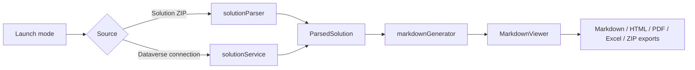

# PP-MD PPTB Edition Codebase Guide

## Purpose

PP-MD PPTB Edition is a React and TypeScript application that generates Power Platform solution documentation from either exported Solution ZIP files or a read-only Dataverse connection supplied by Power Platform ToolBox (PPTB).

The application has three deliberate boundaries:

1. **Collectors** read and normalize solution data.
2. **The shared model** represents ZIP and connected data consistently.
3. **Generators and viewers** render, search, and export documentation without needing to know where the data came from.

## Runtime flow



## Directory map

### Application shell

- `src/main.tsx` mounts React and global styles.
- `src/App.tsx` owns launch mode, queued files, selected Dataverse solutions, document settings, result navigation, export actions, and error/status presentation.
- `src/App.module.css` contains the shell layout, responsive header, grouped export menu, responsive hamburger menu, welcome screen, and app-level focus/layout styles.
- `src/assets/global.css` defines theme tokens, base typography, focus indicators, reduced-motion behavior, print styles, and shared Markdown presentation.

### API and host integration

- `src/api/toolboxAPI.ts` wraps PPTB settings, notifications, connection access, clipboard, external browser, file-system, and Dataverse APIs.
- `src/api/fileManager.ts` provides typed export functions and routes downloads through PPTB when available, with browser fallbacks for local development.
- `src/api/excelExporter.ts` creates styled XLSX workbooks with overview, table, column, relationship, process, app, integration, security, and automation sheets.
- `src/api/pdfExporter.ts` builds a genuine text-based, searchable PDF directly from the generated Markdown (parsed via `unified`/`remark-parse`/`remark-gfm`) using `jsPDF`'s text/table/image drawing APIs — not a screenshot of the rendered view. Mermaid diagrams are embedded as pre-rendered PNGs supplied by `MarkdownViewer`; everything else (headings, paragraphs, lists, tables, code, links) is drawn as real vector text. Unicode symbols outside jsPDF's WinAnsi font range are swapped for ASCII equivalents (`sanitizePdfText`).

### Data model and collectors

- `src/types/solution.ts` defines `ParsedSolution` and all normalized artifact types.
- `src/parser/solutionParser.ts` reads ZIP entries, XML, JSON, and modern artifact files with `JSZip` and `fast-xml-parser`.
- `src/dataverse/solutionService.ts` reads selected solution metadata through FetchXML, OData, and Dataverse metadata APIs. Connected collection is solution-component scoped and does not append environment-wide metadata.
- `src/dataverse/solutionService.test.ts` covers modern artifact capability fallbacks, environment-variable component scoping, value redaction, and collection policy behavior.

### Documentation generation

- `src/generator/markdownGenerator.ts` converts `ParsedSolution` into deterministic Markdown sections, tables, TOCs, Mermaid diagrams, dependency insights, consolidated documents, category files, and companion diagram documents.
- The consolidated document is produced from `consolidateSolutions(...)`, so it uses the same complete artifact model as individual documents.
- `extractDiagramsDocument(...)` moves Mermaid sections into a standalone companion document when requested or when an individual document is too large/complex for comfortable viewing.

### User interface components

- `src/components/SolutionSidebar.tsx` lists individual solutions, the consolidated result, companion diagrams, and component counts.
- `src/components/ui/DropZone.tsx` handles keyboard-accessible ZIP selection and drag/drop.
- `src/components/ui/DataverseSolutionBrowser.tsx` searches, filters, sorts, selects, and refreshes connected solutions.
- `src/components/ui/MarkdownViewer.tsx` renders sanitized Markdown, Mermaid diagrams, raw Markdown, search highlights, copy, internal navigation, and per-document exports.
- `src/components/ui/MermaidDiagram.tsx` renders diagrams with textual captions and fallback content.
- `src/components/ui/ProgressBar.tsx`, `UpdateChecker.tsx`, and `ThemeToggle.tsx` provide status, update, and theme interactions.

### Supporting code

- `src/hooks/useToolboxAPI.ts` manages host detection, active connection initialization, and connection state.
- `src/context/ThemeContext.tsx` manages light/dark theme state.
- `src/utils/versionUtils.ts` handles version comparison and update logic.
- `scripts/check-contrast.mjs` verifies theme-token contrast.
- `scripts/validate-offline.cjs` checks package URLs and offline package constraints.
- `scripts/normalize-dist-assets.mjs` normalizes built assets for PPTB packaging.

## Collection policy

Connected mode supports three policy values:

- `solutionOnly`: selected solution components only; this is the default.
- `solutionAndDirectReferences`: bounded direct-reference context, marked as enrichment rather than solution inventory.
- `environmentAppendix`: separate environment context; it must not be merged into solution sections.

Environment variables are resolved through `solutioncomponent` type `380`. Current-value records are checked only for presence, and live values are not queried or rendered.

## Export behavior

- **Markdown** exports the active document.
- **HTML** exports the rendered sanitized document.
- **PDF** renders the generated Markdown directly into a text-based, searchable PDF (real text/tables/links, not a screenshot); Mermaid diagrams are rasterized from the already-rendered SVGs and embedded as images. The live generation notice remains present through the save-dialog handoff so users are not left with a locked interface and no status.
- **Excel** writes a styled workbook with separate sheets for major artifact families.
- **All Markdown** creates a ZIP containing individual documents, the consolidated document, companion diagrams, and optional dependency reports.
- **By Category** creates category folders for each individual solution and the consolidated document.

## Accessibility behavior

The UI targets WCAG 2.2 AA practices:

- semantic header, navigation, main, section, toolbar, search, list, table, and status landmarks
- skip link to the main content
- native buttons, inputs, selects, checkboxes, details/summary menus, and fieldsets
- shared toolbar typography so native buttons and summary-based menu triggers use identical font and baseline metrics
- visible keyboard focus indicators
- status and progress announcements with `aria-live` and `aria-busy`
- text captions and fallbacks for Mermaid diagrams
- sanitized Markdown and restricted generated badge classes
- reduced-motion support
- theme-token contrast audit for light and dark themes
- responsive reflow and a hamburger menu at narrow widths

Host-level screen-reader, forced-colours, and PPTB iframe checks still require the application to run inside the host because those APIs are not available to the repository test runner.

## Validation workflow

```powershell
npm.cmd install
npm.cmd test
```

The full pipeline runs offline package validation, ESLint, TypeScript, Vitest, contrast checks, and the production build. Focused commands are available through `npm.cmd run type-check`, `npm.cmd run lint`, `npm.cmd run test:unit`, and `npm.cmd run test:contrast`.

## Change guidance

- Preserve the `ParsedSolution` contract when adding artifact families.
- Keep connected queries component-scoped and use explicit fields.
- Never add credentials or environment-variable live values to generated documentation.
- Add a focused regression test for each new collector or generator behavior.
- Keep host-specific behavior in `toolboxAPI.ts` and file export adapters rather than spreading host checks through presentation components.
